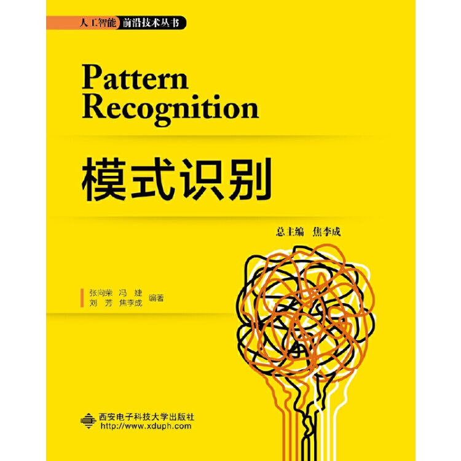
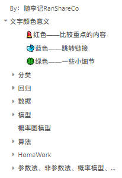
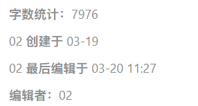

# Pattern_Recognition_Xidian

## Introduction
This project is about 《Pattern Recognition》 class for AI student in Xidian University, including Fisher、KNN、Kmeans、FCM、SVM and so on.

<div align="center"></div> 

## Requirements
- Python>=3.7 [comment use conda]
- numpy
- pandas
- sklearn
- seaborn
- matplotlib
- libsvm-official [only for svm]

## Step-by-step instructions

### Create environment and activate
```
conda create --name name_as_you_like python=3.7
source activate name_as_you_like
```
### Install requirements
You can install requirements recurrently, or just do:
```
pip install -r requirements.txt
```
### Get Code
```
git clone git@github.com:GuoPingPan/Pattern_Recognition_Xidian.git
```

## LIBSVM库的用法

👉[传送连接](https://www.yuque.com/docs/share/74c020fb-4e06-4902-9530-0f563731dba2?#)

## Contract
More learning materials in our WeChat account.

如果可以的话麻烦点个Star⭐，下面是 `公众号:RanShareCo` 的信息，还有多 `笔记资料` 可私戳。

同为XDUer，希望能给大家带来帮助。

- RanShareCo

        

IF there are any other questions, please contract email:
- 731061720@qq.com
- panguoping02@gmail.com
